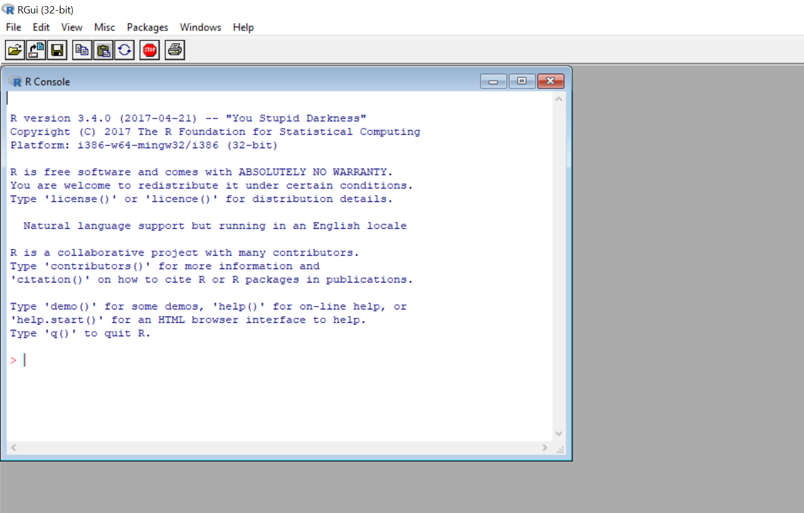
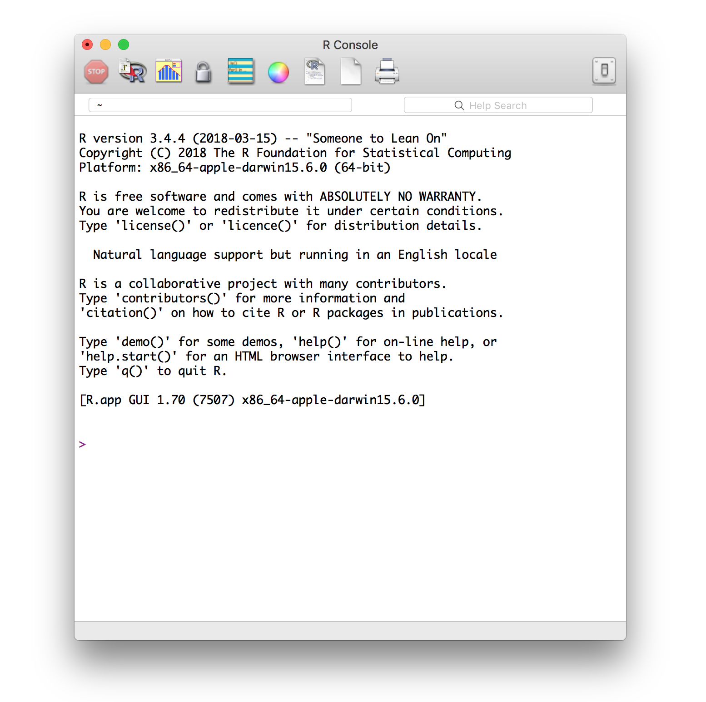
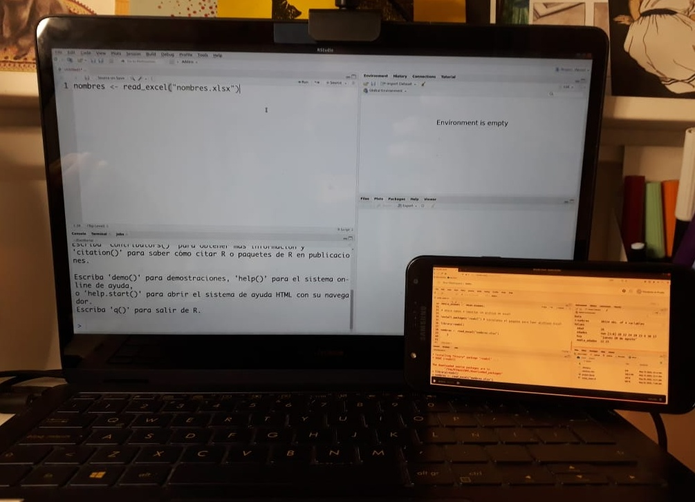

# Módulo: Herramientas Computacionales - sesiones 1 a 5

Durante las primeras cinco clases de este módulo nos familiarizaremos con R y el entorno de trabajo en RStudio. A continuación encontrarás las indicaciones que es necesario que revises **antes de la primera clase de este módulo** (28 o 29 de abril, dependiendo de la sección) para que puedas preparte y participar sin problemas ese día. Estas indicaciones abordan dos aspectos: cómo preparar tu computador y cómo preparar tu espacio de trabajo.

## Prepara tu computador

### Instalación de R y RStudio + RStudio Cloud

En este curso utilizaremos el lenguaje de programación R a través de una plataforma que facilita su uso: RStudio. RStudio es un IDE, es decir, un *Entorno de Desarrollo Integrado* (IDE es el acrónimo de *Integrated Development Environment*). Esto quiere decir que RStudio es una aplicación que nos entrega herramientas para hacer más fácil el desarrollo de proyectos usando R.

Hay dos maneras de utilizarlo: en la nube o instalar todo localmente. Ambas tienen ventajas y desventajas:

**RStudio Cloud**

- *Ventajas*: no requiere instalar nada en tu computador; solo crearte una cuenta. Como tus proyectos están en línea, puedes acceder a ellos desde cualquier computador y compartirlos con otras personas.
- *Desventaja*: requiere conexión a internet y la versión gratuita tiene un límite en la cantidad y tamaño de proyectos que puedes tener.

**RStudio en tu computador**

- *Ventajas*: no necesitas conexión a internet para trabajar (pero sí para instalar "paquetes" -ya veremos qué son los paquetes). También es más intuitivo trabajar con los archivos que están en tu computador (tanto para leerlos como para crear archivos nuevos).
- *Desventajas*: implica instalar cosas. Ese proceso debería ser sencillo; sin embargo, cada computador es distinto y a veces es posible encontrarse con alguna dificultad. De todos modos, nunca serás la primera persona en haber tenido un problema, así que suele ser fácil encontrar una solución en internet.

A continuación mostraremos el paso a paso para ambas opciones. Para la primera sesión es necesario que tengas todo instalado ya en tu computador. La sugerencia es que crees también una cuenta en RStudio Cloud como respaldo.

### Preparar tu computador

Necesitarás instalar tanto R como RStudio. Para ello, sigue los siguientes pasos (¡en orden!).

#### 1. Instala R

Puedes descargar R desde https://cran.r-project.org/. Debes elegir la opción que corresponda, según tu sistema operativo.

Si utilizas Windows, te preguntará qué es lo que quieres instalar. Selecciona "base".

En el caso de Mac, elige la primera opción que aparece bajo "Latest release", es decir, "R-4.0.4.pkg (notarized and signed)".

Luego, sigue los pasos de instalación, tal como lo haces con cualquier programa.

Si todo sale bien, al abrir R en tu computador deberías ver algo parecido a esto en Windows:

Y en Mac se debería ver así:

(La información sobre la versión de R y sobre el sistema operativo que aparece en ese mensaje inicial puede que se vea distinto en tu caso.)

#### 2. Instala RStudio

- Una vez que R ha quedado correctamente instalado, descarga RStudio desde https://www.rstudio.com/products/rstudio/download/. Elige la primera opción, es decir, "RStudio Desktop Open Source License" (gratuita).
- Instala RStudio en tu computador, tal como lo haces con cualquier programa.

Si quedó todo bien instalado, cuando abras RStudio deberías ver algo parecido a esto (algunas cosas pueden variar según tu sistema operativo):

A lo largo del curso usaremos una versión reciente de R y RStudio, así que si tienes instalada una versión previa, puede que algunas cosas se vean un poco distintas. Versiones de R anteriores a la 3.6 harán que algunas cosas no funcionen, por lo que si ese es tu caso, mejor actualizar todo. La última versión de R es la 4.0.4 y la última de RStudio la 1.4.

**IMPORTANTE:** Si te encuentras con algún error durante este proceso, lo más probabable es que sea por alguna configuración de tu sistema operativo. En ese caso, la mejor manera de buscar una solución es copiar el error que arroja R, pegarlo en tu motor de búsqueda favorito y ver cómo alguien que se enfrentó a eso antes lo resolvió.
Si por alguna razón no logras resolver los problemas de instalación antes de la primera clase, no te preocupes. Al final de esa clase habrá un espacio para resolver problemas de instalación, en caso de que te hayas encontrado con alguno. Durante la primera sesión puedes utilizar la versión en la nube de RStudio, así que si algo no funciona, para ese primer día lo más importante sería el siguiente paso.

### RStudio Cloud

#### 1. Accede a [rstudio.cloud](https://rstudio.cloud/)

#### 2. Crea una cuenta
Haz clic en "Sign up" e ingresa tus datos.

Una vez que hayas creado una cuenta, verás algo así. Este es tu espacio de trabajo.

¡Listo! Ya tienes todo lo necesario para la primera sesión.

## Prepara tu espacio de trabajo

Este es un curso práctico. En las sesiones de clases escribiremos "código en vivo", es decir, mostraremos todo el proceso de escritura del código. Lo ideal es que vayas replicando en tu computador todo lo que hagamos nosotras. Para ello, es necesario que pienses en alguna configuración de pantalla que te permita ir mirando lo que hacemos en Zoom y replicándolo en RStudio.  

A continuación hay algunas opciones:

### Una mitad de la pantalla para cada cosa

Es la opción más simple y no requieres nada más que tu computador.

### Una segunda pantalla

Esta es la opción más cómoda, pero no siempre es posible porque requieres más cosas que solo tu computador. Aquí van algunas ideas, en caso de que no tengas un segundo monitor.

#### Conectar tu computador a un televisor

Luego de conectarlo, configura tu computador para que las pantallas no se dupliquen, sino que veas dos cosas distintas en cada una. Así podrás trabajar en tu computador e ir mirando el taller en el televisor:

#### Usar otro dispositivo

Si tienes una tablet, puedes conectarte a Zoom desde ella para mirar la clase y en paralelo trabajar en tu computador. Puedes intentarlo también usando tu teléfono móvil, pero es posible que se vea demasiado pequeño el código. Si optas por esta opción, la sugerencia es que te conectes a Zoom **desde ambos dispositivos**. Así, si en algún momento de la clase algo no te resulta, podrás compartir la pantalla para que podamos resolverlo.

